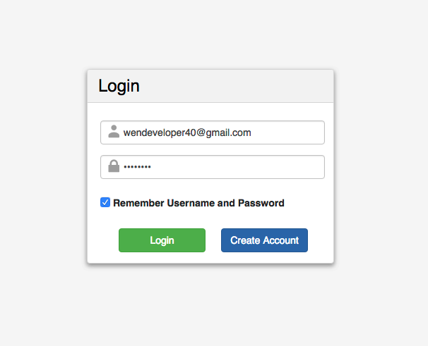
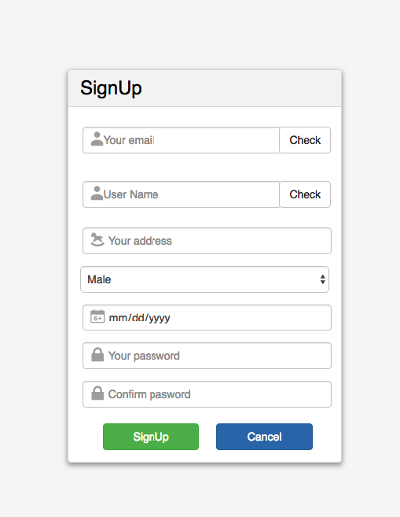
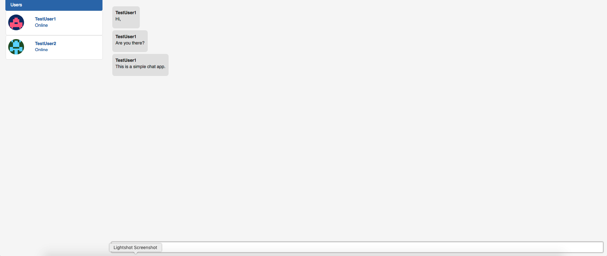

# Chatting App

A web application that allows users to send messages to friends. This is built by React.js, Node.js(Express.js) and WebPack.

For chatting, this app uses Socket.io.

Backend:

* Socket.io
* Express.js
* MongoDB

Frontend:

* React.js
* Redux (Router, Redux-thunk)
* Socket.io
* Webpack

## Prerequisites

You will need the following resources properly installed on the machine.

* [Git](https://git-scm.com)
* [Node.js](https://nodejs.org) (with NPM)
* [MongoDB](https://www.mongodb.com)

## Getting Started

```bash
# Install the dependencies.
$ cd .
$ npm install

### Run the App

```bash
$ cd .
$ node server.js
```

By default, you can visit the API in your web browser at `http://localhost:3030`

## Screenshots

### Login


### Register


### Chat


